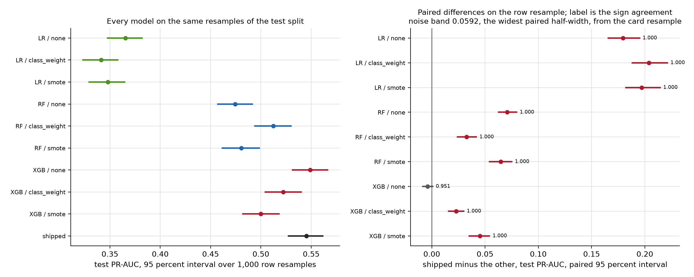
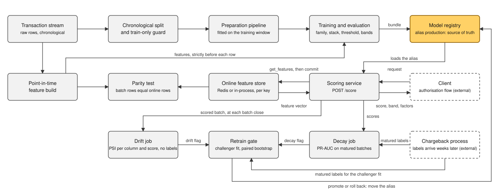

# Fraud Detection Platform

Point-in-time fraud scoring on the IEEE-CIS transaction stream: causal features, a feature store
whose online rows are bit-identical to the training rows, cost-asymmetric thresholds, PSI drift
monitoring and a gated retrain loop, with the leakage each shortcut would have bought measured
rather than assumed.

[](https://github.com/i-hridaysaha/fraud-detection-platform/actions/workflows/ci.yml)


**Case study:** https://www.hridaysaha.com/projects/fraud-detection-platform

**Demo:** https://i-hridaysaha.github.io/fraud-detection-platform/demo/, a replay of the lifecycle
run built from the committed artifacts, served from [docs/demo/index.html](docs/demo/index.html).

## Scope and provenance

Independent project built on the public IEEE-CIS Fraud Detection dataset (Vesta / Kaggle). No
employer data, code, or internal documentation was used.

The architecture, meaning point-in-time feature engineering, feature-store-backed low-latency
serving, cost-asymmetric thresholding, PSI drift monitoring, and gated retraining, reflects
patterns I have applied in production fraud systems. This repository instantiates those patterns
on public data.

Every metric below is reproducible from this repository: `make reproduce`.

## Results

Configuration for every number here: chronological 70 / 15 / 15 split on `TransactionDT`, train
413,378 rows over days 1 to 120, validation 88,581 over days 120 to 152, test 88,581 over days
152 to 182, seed 42, thresholds tuned on validation and applied unchanged to test, every interval
a 95 percent bootstrap over 1,000 resamples of the test window. PR-AUC is the primary metric
because at a test fraud rate of 0.0348 a model that approves everything has accuracy 0.9652, and
ROC-AUC is dominated by the false-positive rate over 85,498 legitimate rows.

**Data note:** these are numbers on public competition data with no merchant, no real label
delay and no live traffic. The value is the pipeline and the measurements, not the absolute
PR-AUC; see Limitations.

### What each shortcut would have bought

The model is held at the shipped configuration and one shortcut at a time is switched on: the
size and the direction of the leakage each common shortcut introduces on this data. Chronological
variants are paired on identical resamples; the two random-split rows are scored on different
rows and their interval is a difference of independent draws.

| Variant | Columns | Test PR-AUC (95 percent interval) | Against the baseline | Reading |
| --- | --- | --- | --- | --- |
| Causal baseline (the shipped configuration) | 186 | 0.5451 (0.5274 to 0.5614) |  | reproduces the shipped model |
| (a) Encoders fitted on every row | 186 | 0.5511 (0.5336 to 0.5678) | +0.0060 (+0.0013 to +0.0108) | inflates by row; by card the interval covers zero |
| (b) Entity aggregates over every row | 262 | 0.5822 (0.5648 to 0.5981) | +0.0371 (+0.0290 to +0.0458) | inflates |
| (c) Entity-mean post-processing of the scores | 186 | 0.4898 (0.4711 to 0.5070) | -0.0554 (-0.0656 to -0.0463) | deflates |
| (d) Random split instead of chronological | 186 | 0.8044 (0.7926 to 0.8171) | +0.2593 (+0.2378 to +0.2809) | inflates |
| (a) + (b) + (c), chronological | 262 | 0.5190 (0.5011 to 0.5360) | -0.0262 (-0.0399 to -0.0141) | deflates by row; by card the interval covers zero |
| (a) + (b) + (c) + (d), random | 262 | 0.8317 (0.8203 to 0.8439) | +0.2866 (+0.2653 to +0.3092) | inflates |

The random split is nine tenths of the whole gap. The published entity-mean post-processing, a
gain on a competition test set, is a loss on a chronological one.

### What late labels do to a model trained on them

Chargebacks arrive weeks after the transaction. The file carries no such delay, so it is
simulated: for the last N days of the training window the fraud labels are either left open
(immature, read as legitimate) or the rows are dropped (excluded), against the shipped model on
the file's labels.

| Labels still open for the last N days | Immature: test PR-AUC (against the reference) | Immature: implied fraud rate | Excluded: test PR-AUC (against the reference) |
| --- | --- | --- | --- |
| 15 | 0.5106 (-0.0345 (-0.0428 to -0.0268)) | 0.0299 | 0.5327 (-0.0124 (-0.0190 to -0.0059)) |
| 30 | 0.4593 (-0.0858 (-0.0961 to -0.0754)) | 0.0195 | 0.4877 (-0.0574 (-0.0662 to -0.0493)) |
| 45 | 0.4163 (-0.1289 (-0.1413 to -0.1170)) | 0.0115 | 0.4839 (-0.0613 (-0.0706 to -0.0528)) |
| 60 | 0.3435 (-0.2017 (-0.2163 to -0.1881)) | 0.0004 | 0.4732 (-0.0719 (-0.0825 to -0.0616)) |
| 90 | 0.1629 (-0.3823 (-0.3964 to -0.3664)) | 0.0000 | 0.4493 (-0.0959 (-0.1069 to -0.0855)) |

At 60 days of open labels the model's implied fraud rate on the test month is 0.0004 against an
observed 0.0348: the recent window has become a regime of its own in which nothing is fraud, and
which columns carry it is not established. Dropping the window costs less at every N.

### Model comparison

Nine fits on one 237-column stack, seed 42, fixed hyperparameters, then the model that ships:
the same family on the 186 columns the ablations kept.

| Family | Imbalance | Columns | Validation PR-AUC | Test PR-AUC (95 percent interval) | Test ROC-AUC |
| --- | --- | --- | --- | --- | --- |
| Logistic regression | none | 606 | 0.4094 | 0.3655 (0.3476 to 0.3818) | 0.8464 |
| Logistic regression | class weight | 606 | 0.3862 | 0.3414 (0.3233 to 0.3577) | 0.8506 |
| Logistic regression | SMOTE | 606 | 0.3892 | 0.3480 (0.3295 to 0.3646) | 0.8476 |
| Random forest | none | 237 | 0.5530 | 0.4744 (0.4573 to 0.4914) | 0.8907 |
| Random forest | class weight | 237 | 0.5466 | 0.5123 (0.4940 to 0.5299) | 0.9027 |
| Random forest | SMOTE | 237 | 0.5134 | 0.4804 (0.4617 to 0.4983) | 0.8778 |
| XGBoost | none | 237 | 0.6198 | 0.5490 (0.5316 to 0.5662) | 0.9111 |
| XGBoost | class weight | 237 | 0.5745 | 0.5221 (0.5044 to 0.5398) | 0.8975 |
| XGBoost | SMOTE | 237 | 0.5373 | 0.4998 (0.4822 to 0.5180) | 0.8748 |
| XGBoost, shipped stack | none | 186 | 0.6184 | 0.5451 (0.5274 to 0.5614) | 0.9050 |

Doing nothing about the imbalance beats weighting and SMOTE in every family on validation. The
shipped model is +0.0328 (+0.0241 to +0.0418) over the best forest, paired, and -0.0039 (-0.0084
to +0.0008) against the 237-column XGBoost it was cut from: 51 columns removed for no measurable
loss. Resampled by card rather than by row its interval widens to 0.5100 to 0.5805, and that
width is where the promotion margin comes from. At the validation-tuned threshold of 0.2519 it
reads on test at precision 0.6034, recall 0.4713, F1 0.5292 and 78.2 alerts per day; the cost
bands (approve, review, block) sit at calibrated probabilities 0.05 and 0.5.



## Why this is non-trivial

- **Card-level labels on a transaction-level task:** no customer id; label purity under `card1`
  alone is 0.8480, and the key `card1 + addr1 + floor(day - D1)` raises it to 0.9664.
- **A population that turns over rather than drifts:** 0.6666 of test entities never appear in
  training, carrying 0.6598 of test rows at fraud rate 0.0440 against 0.0170 on seen ones;
  adversarial validation reaches AUC 1.0000 on identifiers and clocks, not behaviour.
- **MNAR missingness that erasure would destroy:** the identity join covers 0.5477 of fraud rows
  and 0.2332 of legitimate ones; nulls stay nulls, with block indicators.
- **Target encoding against labels that arrive late:** every encoding runs at a 14-day label lag,
  and the entity key is refused as an input because it reproduces the label.
- **Train/serve skew closed by a parity test, not a promise:** 134,339 rows replayed through the
  online store against the batch build, 40 features, largest difference 0.0 on both backends.

## Approach



The transaction stream goes through a chronological split and train-only guard that raises on
any fit which sees a later row. The preparation pipeline is fitted on the training window. The
point-in-time feature build reads, per row, only rows strictly before it; the online feature
store holds the same state per key, and the parity test compares the two. Training and
evaluation register the bundle in the model registry under the alias `production`, the one
source of truth for what is served. The scoring service loads that alias and, per client
request, reads and commits the store, prepares the row, scores, calibrates, bands and returns
the five largest SHAP factors. The drift job runs at each batch close and reads no labels; the
decay job runs once a batch's labels have matured. Confirmed labels arrive from the chargeback
process, outside the scoring path. The retrain gate promotes a challenger only when its paired
advantage clears the margin; rollback moves the alias back.

## Data

**Source:** the two labelled training files of the Kaggle competition `ieee-fraud-detection`,
provided by Vesta: 590,540 transactions with 394 columns over 182 relative days, plus an identity
table of 144,233 rows joined on `TransactionID`. 20,663 rows are fraud, a rate of 0.0350. The
CSVs are not committed and cannot be redistributed; `make data` downloads them with your own
Kaggle credentials once you have accepted the competition rules. A timestamp, card and address
fields, a partial device join and a label are enough for an entity, a chronological split and a
drift window.

**Split and leakage:** chronological at the 0.70 and 0.85 quantiles of `TransactionDT`, boundaries
fixed in `config.py`; the test window is never touched during model selection, and every fitted
object goes through `assert_train_only`, which raises rather than warns. Features are checked
bit for bit against a brute-force recomputation and for truncation invariance; the published
full-dataset aggregation and post-processing live outside `src/`, as the experiments above.

**Excluded:** the competition's test files (no labels); the graph component features, since one
component holds 0.9999 of train rows and its size is a clock; the 36 causal features and four
graph degrees, since adding them moved validation PR-AUC by -0.0052, +0.0029, -0.0076 and then
-0.0049, -0.0015, -0.0079 over three seeds. They are built, tested and served, not read.

## Model

XGBoost, module-default hyperparameters, no reweighting, 186 columns: the prepared frame with the
native count, timedelta and Vesta blocks. A random search over expanding-window folds scored
0.6048 on the full validation window against the default's 0.6184, so the default ships. The
native C block is the most valuable input by ablation (removing it costs -0.0663 to -0.0590 of
validation PR-AUC) and by SHAP (0.2672 of the summed mean absolute value), and what its counters
count is not established.

## Evaluation

PR-AUC as average precision, ROC-AUC and card-level PR-AUC beside it in every artifact. Intervals
by row and by card, paired differences on identical resamples, sign agreement stated. Threshold
by largest F1 on validation, cost bands from an assumed cost matrix, isotonic calibration fitted
on validation; nothing is tuned on test. The promotion margin, 0.06, is the widest paired
half-width across the model pairs (0.0592, by card) rounded up.

**Serving and monitoring:** the scoring path runs at a median 37.6 ms per request, inference
pinned to one thread, 0.081 ms of it the booster; the Redis-backed load test peaks at 25.2
requests per second on one worker and 62.1 on four. Drift edges are calibrated per column on ten
in-control weeks held out one at a time, false alert rate 0.0 where the textbook 0.20 band alerts
on 18.4 columns a week; the largest in-control decay is 0.0510 against a tolerance of 0.06. The
lifecycle demo injects a drift: 14 cycles, 4 challengers, 2 promoted (+0.0954 and +0.0621), 2
refused, one of them better at +0.0424 but under the margin, and a rollback that reproduces the
batch path to 0.0.

## Reproduce it

```bash
python3.12 -m venv .venv && make setup   # pinned versions from pyproject.toml
make data                                 # your Kaggle credentials; accepts nothing for you
make reproduce                            # every artifact and figure, seed 42
make test                                 # the full suite; needs_data tests read the CSVs
```

The seed is `config.SEED = 42`; a test refuses any seed literal outside `config.py`. Each README
number is read from its artifact by `scripts/readme_numbers.py`, and `tests/test_readme.py` fails
when they disagree. Timings and commit hashes inside the artifacts differ between runs; every
score reproduces. The load test and the Redis half of the parity run need a Redis server on
`localhost:6379`; without one, parity runs in-process and the four Redis tests skip.

## Repo map

```
src/fraud_platform/   loader, cleaning, transforms, encoders, features, graph, modelling,
                      evaluation, online store, serving, service, monitoring, lifecycle
scripts/              one driver per stage; each artifact records the command that made it
reports/, figures/    every artifact and figure the docs quote; figures/README.md maps them
docs/                 per-stage analyses, adr/ (41 decision records), notes/, demo/, verification.md
tests/                unit, causality, parity, service and committed-artifact tests
```

[METHODOLOGY.md](METHODOLOGY.md) holds the depth: the EDA summary, the column plan, the encoding
decisions, the feature definitions and the ADR index. [docs/verification.md](docs/verification.md)
names the artifact behind every number in the docs.

## Limitations

- **No merchant or MCC signal:** no column names a merchant or a category code.
- **No observable multi-market structure:** `addr2` is one value on 0.9901 of train rows, so
  `ProductCD` is the only segmentation key.
- **Simulated rather than real label latency:** the file has no chargeback timestamps; the sweep
  and the 30-day maturity window are inputs, not a measured delay.
- **A single-machine replay rather than production traffic:** one laptop replaying a historical
  file with the client on the same cores.
- **The C block:** the most valuable input is a set of counters of unknown construction, read as
  request fields because the serving path cannot compute them from history.
- **Left undone:** no challenger in the demo saw a drifted row, so recovery after a shift is not
  established; the store has no late-arrival policy; the one-row preparation is the latency
  floor and was not rewritten.

## Prior work

The entity key and the time-consistency screen follow the first-place competition entry as
described in McDonald and Deotte, "Leveraging Machine Learning to Detect Fraud: Tips to
Developing a Winning Kaggle Solution", NVIDIA Technical Blog, 26 January 2021,
https://developer.nvidia.com/blog/leveraging-machine-learning-to-detect-fraud-tips-to-developing-a-winning-kaggle-solution/.
Its group aggregates over the identifier are variant (b) above; the contribution here is the
point-in-time reimplementation and the measured cost of each shortcut.

## License

MIT for the code; see [LICENSE](LICENSE). The dataset is not included and is not
redistributable: it is Vesta-provided under the Kaggle competition rules.
